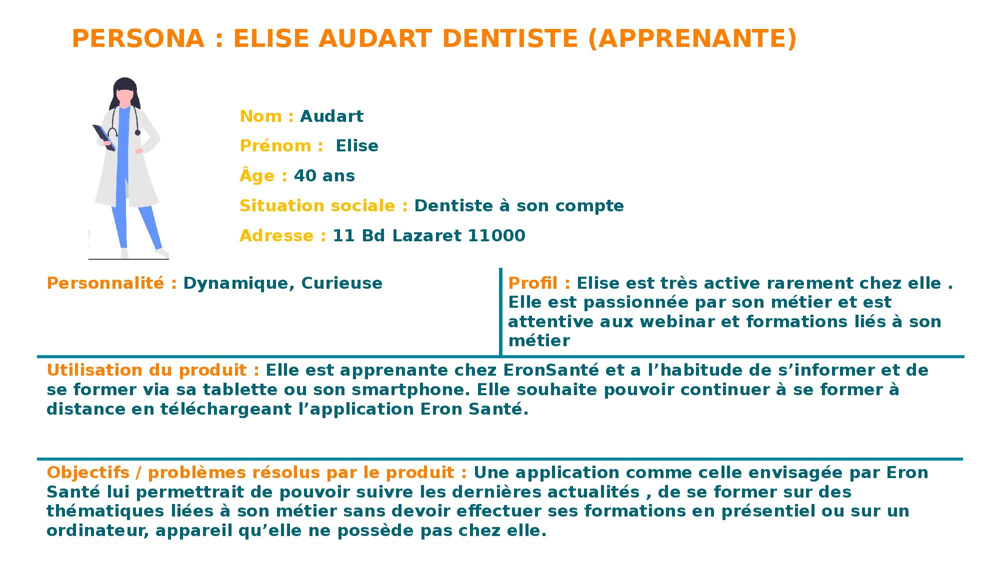
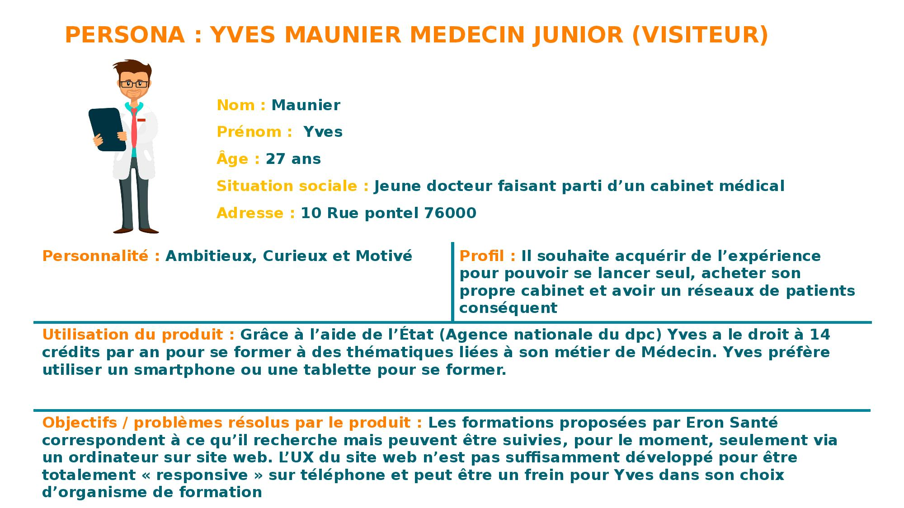

- [Introduction](#introduction)
- [Management method](#management-method)
- [Specifications](#specifications)
  - [Company Eron](#company-eron)
  - [Objective qualitative of Application](#objective-qualitative-of-application)
  - [Customer/User target](#customeruser-target)
  - [Quantitative objectives](#quantitative-objectives)
  - [Project's Scope](#projects-scope)
  - [Design and Ergonomy](#design-and-ergonomy)
    - [Wireframe](#wireframe)
    - [Mockup](#mockup)
  - [Technical and Functional Description](#technical-and-functional-description)
    - [Application tree structure](#application-tree-structure)
    - [App's content information](#apps-content-information)
    - [Techical Demands (constraints)](#techical-demands-constraints)
  - [Performance expected and project management details](#performance-expected-and-project-management-details)
    - [Performance expected](#performance-expected)
    - [Planning](#planning)
    - [Monitoring methodology](#monitoring-methodology)
- [Appendices](#appendices)
- [To discuss and to validate](#to-discuss-and-to-validate)
- [External ressources](#external-ressources)

**Authors of requirements specifications and group of expressing needs**

| Name/Email| Role|
|:----|:----|
| Damien Vert / damien.v@eronservice.fr | Executive Project |
| Bryan Lebar / bryan.l@eronservice.fr    | IT Manager |
| Andria Capai / andria.c@eronservice.fr  | Application Developper and author of this requirements specification |
| Thomas Berton /  thomas.berton83@gmail.com | Partner Developper. Tecnical Manager of Website and New CRM ERON |
| Alex Iosoni / alex.iasoni25@gmail.com | Partner Developper .  Tecnical Manager of Website and New CRM ERON|

 
 

**History of changes and revisions to this document**

| Version number   | Date        | Description and circumstance about modification of Specifications                                                                                  |
|----------------- |------------ |--------------------------------------------------------------------------------------------------------------------------------------------------- |
| v 0.1 (Initial)  | 07/06/2021  | Specification draft , which the initial requirements specification followed by the first internal meeting and the meeting with partner Developper  |
| v 0.2   | 24/06/2021  | Mockup (figma) and Wireframe (excalidraw) validate during internal meeting (according to feedback gave by employee) |
| v 0.3  | 01/07/2021  | Add Functional and technical description for specification , Add Methodology and project management details  |

 
 

**Validations**

| Version number   | Reviewer's Name and Role   | Date and signature  | Possible comments or potential reserves  |
|----------------- |--------------------------- |-------------------- |----------------------------------------- |
| V 0.1 (Initial)  |                            |                     |                                          |

 
 

# Introduction

This file is a description of working-study training between SIMPLON (training organisation) and ERON Santé (company).   
The goal of this file is to describe everything about specifications,  wireframe, mockup, workflow, code developped management method, softwares use, perspectives and other things needed for the certification programm.

The main project give by ERON Company is to build an Application Mobile.
The main goal of this app is to offer for users the possibility to : discover courses medical education , to buy or show more information about these courses,  connect to their account in order complete their training, see their progression, deadline monitoring and also information about EronSante company.

# Management method

Below is every human ressources with their duties/functions need to know in order to manage the project :

- Direction:
  - Damien Vert (chef executive) : damien.v@eronservice.fr
  - Arthur Balme  (chef executive) : arthur.b@eronservice.fr
  - Fabien Direction ERON / EFIA : fabien.balme@gmail.com
- Administrative / Financial Manager
  - Philippe Vert : daf@eronservice.fr
- Communication:
  - Louis Serge Real del Sarte : lsdelsarte@eronservice.fr
  - Alexandra Lages : alexandralages1@gmail.com
- Teaching Manager:
  - Marielle Glikpo : marielle.g@eronservice.fr
  - Bouchra : resp.pedago@eronservice.fr

- IT manager:
  - Bryan Lebar : bryan.l@eronservice.fr

- Developper Partner :
  - Thomas Berton : thomas.berton83@gmail.com
  - Alex Iasoni : alex.iasoni25@gmail.com

In order to success to build the app, we are using **Agile method (Scrum)** (sprint's time to be define but pribably 2 weeks) with software **trello** (intern to the company) and **clickup** (with external people). Also Thomas Berton and Alex Iasoni ask ERON to communicate via WhatsApp and Clickup about the App and Website/CRM.
Trello board name : "Appli Mobile".
ClickUp Space name : Application Mobile ERON/EFIA.

# Specifications

## Company Eron

**ERON Santé** is a company in continuing education for medical personal online. Profession fields target are : Doctors, Dentists, Nurses, Physiotherapists and Pharmacists.

**Training courses** number are estimated at more than 5000 .

**Certification Qualiopi, Datadock, AFAQ 9001** are all gets by ERON Santé which is a proof of high quality training.

**6 days / 7 days** of avaiblity to advice learner medical employees.

**Bloc skills** are built and think with expert in order to offer the best training four their learner.

Thanks to their huge social network ERON Santé , gets more than **1 million of users**.

**Functionning**  of the company is articulated with 2 main mplayers : **Professionnal trainers** and **Health Professionnal liberals**.

- **Health Professionnal liberals** gets 14 credits (14Hours) paid by the State and which is manage by **Développement Professionnel Continu(DPC)** and they can also get training paid by **Union nationale des professions libérales UNPL** which have the **Fonds interprofessionnel de Formation des Professionnels libéraux (FIFPL)** . To get those formation financed by State and FIFPL **EronSanté** use the **Commercial website** (describe below) Finally the **Helat Professionnal liberals** can also choose to pay by theirself training offer by **EronSanté** on the website **Gafeo** (describe below)

**[Their commercial website](https://eronsante.com/qui-sommes-nous-notre-organisation/)** is built with **CMS Wordpress** and gets 5 main view :

- Home [website](https://eronsante.com/)
- Our Training [website](https://eronsante.com/nos-formations/)
- Actuality [website](https://eronsante.com/actualites/)
- Who are ? [website](https://eronsante.com/qui-sommes-nous/)
- Contact [website](https://eronsante.com/contact-service-client/)
The website allow medical professional visitor to:
- browse training list organize by topic ( Doctors, Dentists, Nurses, Physiotherapists and Pharmacists) and to see for each training description : **Short Description, Objectives,Content, DPC number, Duration**.
- Book training by a **Button Booking** which redirect to **[typeform](https://erons.typeform.com/to/g5qYvNaf)** with 10 questions:
  - Ask visitor if it is sure to be medical professional and to be interested by subscribe to their training
  - professionnal type
  - choose training
  - period to pass training session (15 days)
  - name
  - email
  - date of birth

**[Their website for learner (E-learning Platform)](https://eronsante.com/qui-sommes-nous-notre-organisation/)** is  **Learning Management System (LMS)** and write with programmation langage Python. Here are structure of website :

- Login view
- Main View with :
  - Top left menu hamburger (wich change content according to the page)
    - Dashbaord with courses subscribed
  - Top right avatar with profile section
- Shop view : where it is possible to pay for more training by personnal funds.

The **customer relationship management (CRM)** is **dolibarr** and provide by  **open-dsi**. **Dolibarr** is write with **Python language**. [Link to Website](https://eron-dlb.open-dsi.fr/doliprod/index.php?mainmenu=home).

<!-- TODO: Penser à ajouter ces infos :  • Les statistiques actuelles (trafic mensuel, taux de rebond, taux de conversion, nombre d’inscrits, nombre de téléchargement) • Le nombre de pages -->

<!-- TODO: Ajouter graphique environnement digitale de l'utilisateur (website, app) avec les technologies etc -->

<!-- TODO: Add concurrent or EronSanté (see app) -->

## Objective qualitative of Application

The company EronSanté's need/requirement to creat a mobile application from scratch was born by mutlitple facts :

- More and more feedback from users/learners using website would like to get their training courses on mobile or tablet.
- Company startegy is to :
  - increase fidelity of their learners by allow learners to follow their training session on mobile or tablet
  - target younger health professionnal (currently main users are 40-50 years old)
  - In the future to create a "Eron Academy" where learners invest trust in EronSnaté based on philosophy/idea and keep users longer such as vision of 3 years

## Customer/User target

Here are information about profile users of Application EronSanté, based on usual users on current website and on strategy company :

- Persona Learner :
  - Age : >40 years old
  - Experience work : many years
  - Profession type : Doctors, Dentists, Nurses, Physiotherapists and Pharmacists
  - Platform device : tablet, smartphone
  - View picture persona in section [Appendices](#appendices)
- Persona visitor :
  - Age : 20 -30 years old
  - Experience work : Juniors
  - Profession type : Doctors, Dentists, Nurses, Physiotherapists and Pharmacists
  - Platform device : tablet, smartphone
  - View picture persona in section [Appendices](#appendices)

<!-- TODO: Add persona picture for the final pdf -->

## Quantitative objectives

- Target number of download on Store App ?
- Target of typeform filled with the app
- Target number of users complete lesson with app
<!-- TODO: Ask to ERONSANTE or SEARCH number of concurrent -->

## Project's Scope

- Language App : French
- Language Programmation :
  - FrontEnd Framework : ReactNative was choose at the beginning with ERON Team. After meeting on 2nd of June 2O21 with 2 developper Thomas Berton and Alex Lisoni , they ask us to change and use Angular Ionic;
  - Software Development:  AndroidStudio and XCode
- Platform : iOS / Android
- Devices app run on : tablet , Smartphone
- Type of Application : showcase/ Learning / Shop
- Module of website to integrate :
  - News
  - Shop (from FIFPL or Dcp)
    - typeform
  - Catalogues
- App screens and features :
  - Home screen (everybody) with :
    - Training by category
    - News
    - Contacts
    - FAQ
  - Login screen (learner):
    - Profil screen:
      - Notification (date start and end of training session) (features)
      - Contacts
      - FAQ
    - Personnal Training (screen)
      - Sumup /progress (screen)
      - List of training susbscribe (screen)
    - Shop screen with 3 steps (features) and only paid by personal founds :
      - User information
      - Order's details
      - secured payment

- App functions: The app will allow user to see catalogues, news EronSanté, login (if they follow courses), see details of their training (start-end date session, number of hour spend, percentage completion),read and complete module training, to be redirect to shop training link with Dpc account.

## Design and Ergonomy

### Wireframe

To list all of features needed for the Application we describe User stories:

- As a **learner** I want to **connect with my login and password** so that I can  **access to my personnal account**.
- As a **Learner** I want to **access to my lessons on smartphone/tablet** so that I can **complete training's module easily and everywhere**
- As a **Learner** I want to **be notified when the deadline is coming** so that I can  **finish training in time**
- As a **Learner** I want to **see sumup of all my training** so that I know **more about my training progress**
- As a **Learner** I want to **contact customer service** so that I can **get more informations, no available in the App FAQ**
- As a **Visitor** I want to **see informations about ERON** so that I can **contact them**
- As a **Visitor** I want to **see all training offer by ERON** so that I can **Subscribe to training session with DPC or FIFPL credits**
- As a **Visitor** I want to **know news about my job** so that I can **get information about my job directly on my smartphone**

### Mockup

Figma will be used in order to design mockup. The project Figma and the prototype to see interactive mockup is [available here](https://www.figma.com/proto/auNdUSZ0D6N5bqd2ptjYSw/Application_ERON?node-id=93%3A20615&scaling=scale-down&page-id=11%3A270).

## Technical and Functional Description

### Application tree structure
<!-- TODO: Add schema in order to explain main section to details -->

### App's content information

What it is expecting from ERON company :

- Create from scratch the application and integrate website ERON information (CMS Wordpress) , GAFEO platform (LMS, Moodle) data about user (learner) thank's to an API build by the two developper Thomas Berton and Alex Iasoni.
- Pictures and contents training are furnished by company ERON.
- Pictures are available from free website (pixabay, freepik, storyset.com) and also from stock.adobe ERON Company account.

### Techical Demands (constraints)

In order to build the app, the app designer programmer will have to :

- Work with developper of CRM, Moodle and Website (Thomas Berton and Alex Iasoni)
- Integrate API (API given by Thomas Berton and Alex Iasoni) about website, CRM, Moodle GAFEO , inside Mobile App.
- Designer Programmer App will have to carry out Front end of the App and nothing about CMS, CRM or Moodle has to be carry out by the App Designer Programmer.
- Solutions used for UX design : Excalidraw and Figma
- Solutions used for App development : Framework Angular Ionic Capacitor
- Solutions used for management project : Trello and Slack (internal communication) , what's app and ClickUp (external communication)

## Performance expected and project management details
<!-- Prestations attendues -->

### Performance expected

- List of performances expected to internal Designer Developer Application :
  - UX Design Application
  - FrontEnd Development Application

- List of performances expected to external partenship (Alex Iasoni and Thomas Berton):
  - Website redesign (CMS wordpress)
  - Moodle platform GAFEO
  - CRM (Dolibarr)
  - Build API in order to give to the App Designer Programmer (ERON Company)

### Planning

<!-- TODO: GANT Project list step -->
<!--
[ ]: Wireframe
[ ]: Mockup
[ ]: Prototype (Development App)
[ ]: Production App
[ ]: Tests
[ ]: Store deployment (apple, google)
-->

### Monitoring methodology

About monitoring methodology there are two kind : internal and external company.

For internal company :

- Trello and Slack are the main platform communication between internal developer and other employees company (direction and backoffice)
- Git (with github) distributed version control system (DVCS) is used by internal developer in order to manage application development
  - Git branches naming convention and git Workflow : 
    - Master (this branch will contains only stale version of the App)
    - Develop (this branch will get all history of the app)
    - Features (branches created from Develop branch and merge only on Develop Branch, and finally deleted the feature's branch)
    - Release (branch forked from Develop and merged to master once the release is check by a pull request)
    - HotFix (branch forked directly from master branch and once bugfix then we have to merge into master and develop branch and add updated version number to master branch, finally delete branch hotfix)
  - See more details about workflow [here](https://www.atlassian.com/fr/git/tutorials/comparing-workflows/gitflow-workflow)
- Each week (on wednesday) an internal meeting is carried out in order to talk different kind of Company's topic/matters.
- Agile method with sprint's last of 2 weeks is targeted

For external company :

- WhatsApp and ClickUp are the main platform communication between internal developer and external developer.
- Git created by internal designer programmer (Andria Capai) is shared with external developer.

For external company

# Appendices

 Fig.1 - Persona learner

 Fig.2 - Persona visitor

# To discuss and to validate

| Questions / Matter of discussion                                               | Context of discussion  | Category of discussion     | Author's question and role                                                    | Comments / Answer   | State (?,x,v)  | Author's reviewer             | Meeting's date to validate  |
|------------------------------------------------------------------------------- |----------------------- |--------------------------- |------------------------------------------------------------------------------ |-------------------- |--------------- |------------------------------ |---------------------------- |
| Does the learner will get directly the training activated after the payment ?  | Wireframe's feedback   | Screen/ UX / Wireframe     | Tiffany.j@eronservice / Backoffice                                            |                     | ?              |                               |                             |
| Another tab for shop to let the learner by training                            | Wireframe's feedback   | Screen/ UX / Wireframe     | Tiffany.j@eronservice.fr / Backoffice damien.v@eronservice.fr / Direction  | yes                 | v              | Damien Vert and Andria Capai  | 04/06/2021                  |
| How precisely the learner could choose to be notified for deadline training ?  | Wireframe's feedback   | Features / UX / Wireframe  | Tiffany.j@eronservice / Backoffice                                            |                     | ?              |                               |                             |

# External ressources

<!-- ## 7. QQOQCCP

***
| Questions  | Réponses |
| :--------: | :------: |
|   Quoi ?   |          |
|   Qui ?    |          |
|    Où ?    |          |
|  Quand ?   |          |
| Comment ?  |          |
| Combien ?  |          |
| Pourquoi ? |          | -->

<!-- TODO: Cahier des charges : -->
<!-- [x] : Bête à cornes -->
<!-- [ ] : Diagramme des interacteurs -->
<!-- [ ] : Objectifs SMART -->
<!-- [ ] : Matrice SWAT-->
<!-- [ ] : QQOQCCP -->
<!-- [x] : Cartouche [voir studi](https://app.studi.fr/#/dashboard/medialibrary/1561/matieres/44694/modules/53593/themes/109337/ressource/79594/lecteur) -->
<!-- [ ] : Périmetre fonctionnels  -->
<!-- [ ] : Abres des objectifs -->
<!-- [ ] : Ecosysteme digital -->

<!-- NOTES: gestion typeform par  -->
<!--  NOTES: fidéliser les clients (3ans), partenaire Dictionnaire VIDAL (ressources externes partenaires), teamDoc (partage de photos médical), viser un public plus jeune ->
<!-- NOTES: Possibilités de télécharger la fiche récap de fin de formation pour éviter d'appeler le backoff -->
